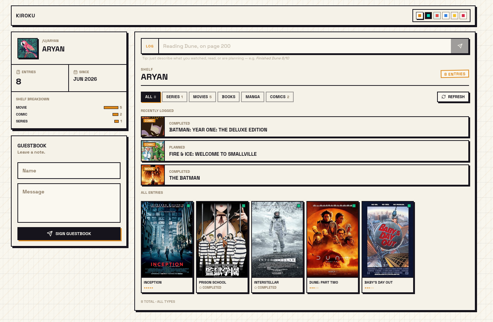
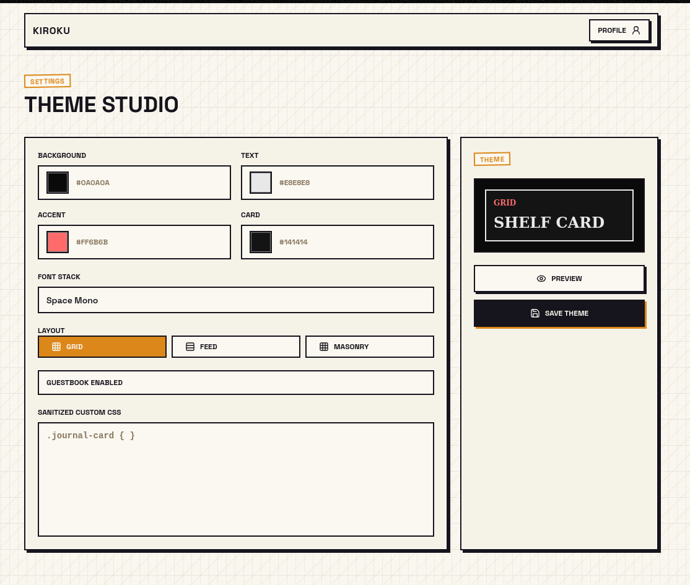

# Kiroku

A public media journal that feels like a stamped desk file. Log what you watch, read, and listen to — through natural language or manual entry. Each profile gets its own route, cover art, ratings, and a fully customizable theme.

**Kiroku** (記録) — Japanese for *record* or *journal*.

**Live**: [kiroku-j.vercel.app](https://kiroku-j.vercel.app/u/demo) · **Backend**: [kiroku-api](https://github.com/aryansaves/kiroku-api)

## Screenshots

| Public journal | Theme studio |
|---|---|
|  |  |

## Features

- **Natural language logging** — Type *"finished watching Frieren, 10/10"* and AI parses title, media type, status, and rating. Works from the web or Telegram.
- **Public journal** — Every user gets a shareable profile at `/u/<username>` with cover art, ratings, progress, and notes.
- **Six media types** — Anime, movies, series, books, manga, comics — each with type-specific metadata fields.
- **Custom themes** — Six color palettes, configurable layout, stickers, an embedded song link, and custom CSS.
- **Guestbook** — Visitors can leave messages on a journal page.
- **Multiple auth providers** — Google OAuth, Telegram Login Widget, or dev-only username login for local testing.

## Tech stack

| Layer | Technology |
|-------|------------|
| Framework | [Next.js 16](https://nextjs.org/) (App Router) |
| UI | [React 19](https://react.dev/) |
| Styling | [Tailwind CSS 3](https://tailwindcss.com/) with CSS custom properties |
| Icons | [Lucide React](https://lucide.dev/) |
| Language | [TypeScript](https://www.typescriptlang.org/) (strict mode) |
| Backend | [kiroku-api](https://github.com/aryansaves/kiroku-api) (Express + MongoDB + Redis) |

## Getting started

Requires Node.js 20+ and a running [kiroku-api](https://github.com/aryansaves/kiroku-api) instance, or demo data enabled for frontend-only development.

```bash
git clone https://github.com/aryansaves/kiroku-f.git
cd kiroku-f
npm install
cp .env.example .env.local
npm run dev
```

Runs on `http://localhost:3001` by default.

## Environment variables

| Variable | Default | Description |
|----------|---------|-------------|
| `NEXT_PUBLIC_API_BASE_URL` | `http://localhost:3000` | Backend API URL, must be reachable from the browser |
| `NEXT_PUBLIC_USE_DEMO_DATA` | `true` | Serve hardcoded demo content when the API is unavailable |
| `NEXT_PUBLIC_TELEGRAM_BOT_NAME` | — | Telegram bot username for the login widget |
| `NEXT_PUBLIC_ENABLE_DEV_LOGIN` | `true` | Username-only login, no auth provider needed |
| `NEXT_PUBLIC_GOOGLE_AUTH_ENABLED` | `false` | Enable the Google OAuth login button |
| `NEXT_PUBLIC_SITE_URL` | `http://localhost:3001` | Canonical URL for Open Graph metadata |
| `NEXT_PUBLIC_ROOT_DOMAIN` | `localhost` | Root domain for subdomain routing (`username.example.com` → `/u/username`) |

All variables require the `NEXT_PUBLIC_` prefix to be available in the browser.

## Scripts

| Command | Description |
|---------|-------------|
| `npm run dev` | Start the dev server on port 3001 |
| `npm run build` | Production build |
| `npm start` | Start the production server |
| `npm run lint` | Run ESLint |
| `npm run typecheck` | Type-check without emitting |
| `node scripts/seed-dev-user.mjs <username> [displayName]` | Seed a test user in MongoDB (`MONGODB_URI` required) |

## Project structure

```
kiroku-f/
├── app/                    — Next.js App Router pages
│   ├── auth/callback/      — Google OAuth callback handler
│   ├── login/              — Login page (Google / Telegram / Dev)
│   ├── onboarding/         — New Google user username picker
│   ├── settings/           — Profile and theme settings
│   ├── u/[username]/       — Public user journal
│   ├── layout.tsx          — Root layout (fonts, metadata, palette preload)
│   └── page.tsx            — Landing page
├── components/
│   ├── auth/                — Login panel, nav auth, session redirect
│   ├── chat/                — Chat-based log input + quick-log bar
│   ├── journal/              — Log cards, shelf grid, type filters
│   ├── profile/               — Bio sidebar, guestbook, song player
│   ├── settings/               — Profile and theme settings forms
│   ├── stickers/                — Decorative sticker overlay
│   └── theme/                    — Palette switcher + theme provider
├── lib/
│   ├── api.ts               — API fetch functions + mock fallback
│   ├── client-auth.ts        — localStorage session management
│   ├── mock-data.ts           — Demo user and log data
│   ├── theme.ts                — Theme variable conversion
│   └── types.ts                 — TypeScript type definitions
├── scripts/seed-dev-user.mjs  — MongoDB seed script for local dev
├── proxy.ts                — Middleware for subdomain routing
└── docker-compose.yml      — Redis for the backend API
```

## Architecture

**Routing** — `/` landing, `/login` auth, `/auth/callback` post-OAuth redirect, `/onboarding` username picker for new Google users, `/u/[username]` public journal, `/settings` and `/settings/theme` for profile and theme editing.

**Middleware** — `proxy.ts` rewrites subdomain requests (`username.kiroku.com` → `/u/username`) so users can share clean URLs.

**Data flow** — In API mode, all reads/writes go through `NEXT_PUBLIC_API_BASE_URL`; auth tokens live in `localStorage` and auto-refresh on expiry. In demo mode (`NEXT_PUBLIC_USE_DEMO_DATA=true`, or visiting `/u/demo`), the app falls back to hardcoded mock data — lets you build UI without a running backend.

**Theme system** — Six color palettes defined both as an inline `<script>` (zero-flash restoration on hard reload) and as React state in `ThemeProvider`. Choice persists in `localStorage`. Colors are CSS custom properties (`--ink`, `--paper`, `--accent`, `--card`, `--muted`) consumed by Tailwind utilities.

## Backend

This frontend depends on [kiroku-api](https://github.com/aryansaves/kiroku-api) — an Express server handling auth (Google OAuth, Telegram, dev tokens, JWT refresh), journal CRUD with AniList/MAL/TMDB enrichment, AI-powered NLP parsing, profiles, guestbook, and MongoDB + Redis storage.

For local development, run the API locally or set `NEXT_PUBLIC_USE_DEMO_DATA=true` to work on the frontend in isolation.

## Deployment

Deployed on [Vercel](https://vercel.com) at [kiroku-j.vercel.app](https://kiroku-j.vercel.app). Pushes to `master` deploy automatically. Set environment variables in the Vercel dashboard (Settings → Environment Variables) matching production values from `.env.local`.